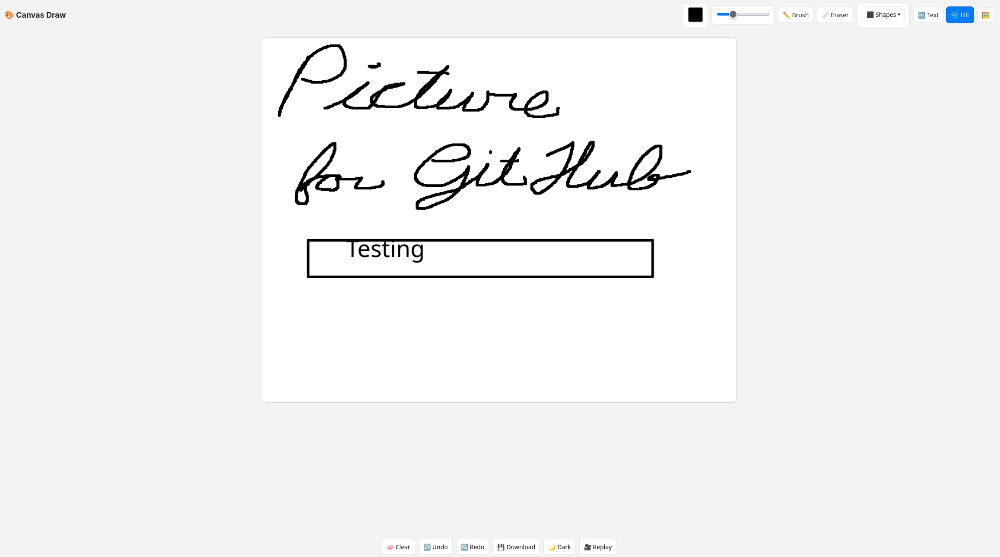

# Canvas Draw

## Overview
Canvas draw is a web-based drawing tool built with HTML5 Canvas and JavaScript. It allows users to create digital artwork with a brush, eraser, shapes, text, and flood fill. Features include background image support, undo/redo, dark mode, timelapse replay, and image download.  

---

  
**Try it live**: [https://lintony6.github.io/Canvas](https://lintony6.github.io/Canvas)

## Features
- **Tools**: Brush, eraser, shapes (rectangle, circle, line), text, flood fill.
- **Background Image**: Upload an image; eraser preserves it.
- **Undo/Redo**: Up to 50 actions.
- **Clear Canvas**: Removes drawings, keeps background.
- **Download**: Save artwork as PNG.
- **Dark Mode**: Toggle light/dark theme.
- **Timelapse Replay**: Watch drawing process animated.
- **Responsive**: Canvas resizes with window.
- **Touch Support**: Works on mouse and touch devices.

## Installation
### Prerequisites
- Modern web browser (Chrome, Firefox, Safari).

### Setup
1. Clone the repository:
   ```bash
   git clone <repository-url>
   ```
2. Deploy to GitHub Pages (easiest):
   - Enable Pages in repo settings (source: main branch).
   - Visit `https://<username>.github.io/<repo-name>`.
3. Or serve locally:
   ```bash
   npm install -g http-server
   http-server .
   ```
   Open `http://localhost:8080`.


## Technical Details
- **Layered Canvases**:
  - `bgCanvas`: Static background image or white fill (z-index: 1).
  - `drawingCanvas`: User drawings (z-index: 2).
  - Eraser uses `destination-out` on `drawingCanvas` to reveal `bgCanvas`.
- **State**:
  - `strokes` array stores actions for replay/undo.
  - `undoStack`/`redoStack` for snapshots (max 50).
- **Events**: Pointer Events for mouse/touch compatibility.
- **Key Functions**:
  - `setCanvasSize`: Resizes canvases.
  - `beginStroke`/`continueStroke`/`endStroke`: Freehand drawing/erasing.
  - `drawShapePreview`/`commitShape`: Shape drawing with previews.
  - `placeTextAt`: Text input.
  - `floodFill`: Stack-based fill.
  - `setBackgroundImage`: Loads background to `bgCanvas`.
  - `replayTimelapse`: Animates drawing process.

## Known Issues
- Large canvases/many strokes may slow replay on low-end devices.


## License
This project is licensed under the MIT License.  
© 2025 Tony Lin
